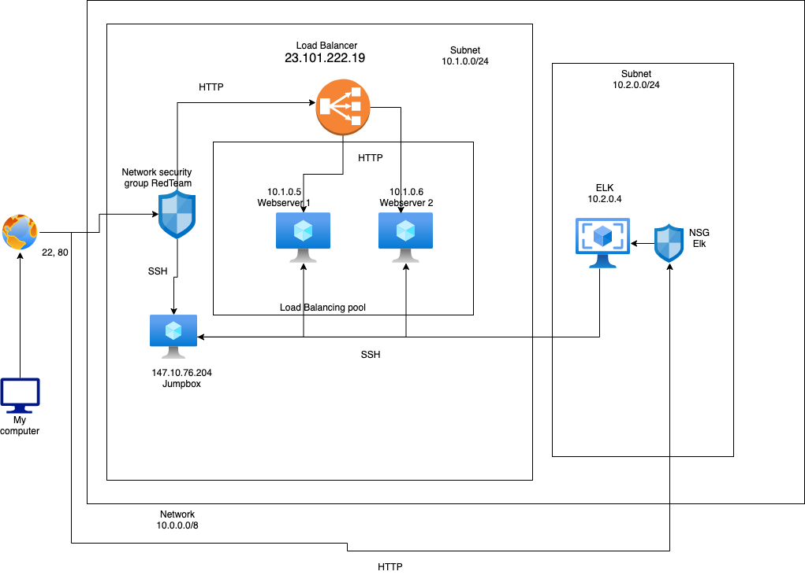
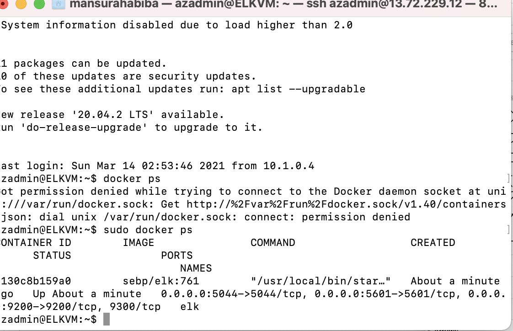

## Automated ELK Stack Deployment

The files in this repository were used to configure the network depicted below.



These files have been tested and used to generate a live ELK deployment on Azure. They can be used to either recreate the entire deployment pictured above. Alternatively, select portions of the YAML file may be used to install only certain pieces of it, such as Filebeat.

```
---
- name: Configure Elk VM with Docker
  hosts: elk
  remote_user: azadmin
  become: true
  tasks:
    # Use apt module
    - name: Install docker.io
      apt:
        update_cache: yes
        name: docker.io
        state: present

      # Use apt module
    - name: Install pip3
      apt:
        force_apt_get: yes
        name: python3-pip
        state: present

      # Use pip module
    - name: Install Docker python module
      pip:
        name: docker
        state: present

      # Use sysctl module
    - name: Use more memory
      sysctl:
        name: vm.max_map_count
        value: "262144"
        state: present
        reload: yes

      # Use docker_container module
    - name: download and launch a docker elk container
      docker_container:
        name: elk
        image: sebp/elk:761
        state: started
        restart_policy: always
        published_ports:
          - 5601:5601
          - 9200:9200
          - 5044:5044

      # Use systemd module
    - name: Enable service docker on boot
      systemd:
        name: docker
        enabled: yes
#EOF
```


This document contains the following details:
- Description of the Topology
- Access Policies
- ELK Configuration
  - Beats in Use
  - Machines Being Monitored
- How to Use the Ansible Build


### Description of the Topology

The main purpose of this network is to expose a load-balanced and monitored instance of DVWA, the D*mn Vulnerable Web Application.

Load balancing ensures that the application will be highly available, in addition to restricting __access___ to the network.
- _TODO: What aspect of security do load balancers protect? What is the advantage of a jump box?_
A load balancer enable to connect to the most available webserver, and a jumbox emables us to connect to the network via SSH

Integrating an ELK server allows users to easily monitor the vulnerable VMs for changes to the ___metrics __ and system files_____.
- _TODO: What does Filebeat watch for?_ How often peope accessed the files of the VM
- _TODO: What does Metricbeat record?_ The usage of the VM (CPU etc.)

The configuration details of each machine may be found below.
_Note: Use the [Markdown Table Generator](http://www.tablesgenerator.com/markdown_tables) to add/remove values from the table_.

| Name     | Function | IP Address | Operating System |
|----------|----------|------------|------------------|
| Jump Box | Gateway  | 13.72.229.12 and  10.0.1.4 | Linux            |
| Webserver 1     |      Web server    |     10.1.0.5      |        Linux          |
| Webserver 2    |      Web server    |    10.1.0.6    |        Linux          |
| ELK    |    Monitor traffic      | 10.2.0.4           |   Linux            |

### Access Policies

The machines on the internal network are not exposed to the public Internet. 

Only the loadbalancer machine can accept connections from the Internet. Access to this machine is only allowed from the following IP addresses:
- my public IP 

Machines within the network can only be accessed by SSH.
- _TODO: Which machine did you allow to access your ELK VM? What was its IP address?_ Jumpbox IP is 13.72.229.12

A summary of the access policies in place can be found in the table below.

| Name     | Publicly Accessible | Allowed IP Addresses |
|----------|---------------------|----------------------|
| Jump Box | Yes              | my public IP    |
|   Webserver1       |       no              |             VNet         |
|       Webserver2   |         no            |            Vnet          |
| ELK | Yes | my public IP|

### Elk Configuration

Ansible was used to automate configuration of the ELK machine. No configuration was performed manually, which is advantageous because...
- There is less human error and it is faster in a large business

The playbook implements the following tasks:
- Install docker.io
install python
install the docker python module 
change the memory size
open the ports
enable docker on boot


The following screenshot displays the result of running `docker ps` after successfully configuring the ELK instance.



### Target Machines & Beats
This ELK server is configured to monitor the following machines:
- I am monitoring the two Webservers 10.1.0.5 and 10.1.0.6

We have installed the following Beats on these machines:
- filebeat 

These Beats allow us to collect the following information from each machine:
- filebeat collects the logs of which and how often the  files where opened or downloaded or uploaded 

### Using the Playbook
In order to use the playbook, you will need to have an Ansible control node already configured. Assuming you have such a control node provisioned: 

SSH into the control node and follow the steps below:
- Copy the YAML file to _ansible.
- Update the __YAML___ file to include the webserver and ELK configurations..
- Run the playbook, and navigate to _ELK to check that the installation worked as expected.

_TODO: Answer the following questions to fill in the blanks:_
- _Which file is the playbook? Where do you copy it?_ pentest.yml and Elk.yml
- _Which file do you update to make Ansible run the playbook on a specific machine? How do I specify which machine to install the ELK server on versus which to install Filebeat on?_ 
The hosts file, by adding the IP of my VMs. I install filebeat on ansible
- _Which URL do you navigate to in order to check that the ELK server is running?
http://20.86.81.12:5601/app/kibana#/home

